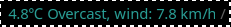

# Погода для i3status

Простий плагін погоди, дані бере з [open-meteo.com](https://open-meteo.com).
Оновлюється щогодини, якщо налаштувати cron.

# Налаштування

До файлу /home/$(USER)/.config/i3status/config додайте наступне:

```
order = "read_file weather"

read_file weather {
    path = <шлях до скрипта>
    fotmat = "%content"
    }
```

Тепер виконайте __python <шлях до скрипта>__ щоб отримати файли data.json та weather.txt, програма виведе в термінал погоду на теперішню годину.
Перезавантажте i3 (meta+shift+r), i3status повинен показати погоду як на картинці 


Щоб скрип запускався щогодини, потрібно налаштувати crontab.
В терміналі виконайте команду

```
crontab -e

```

Та напишіть:

```crontab
0 * * * * python <full path to weather.py script>
```

